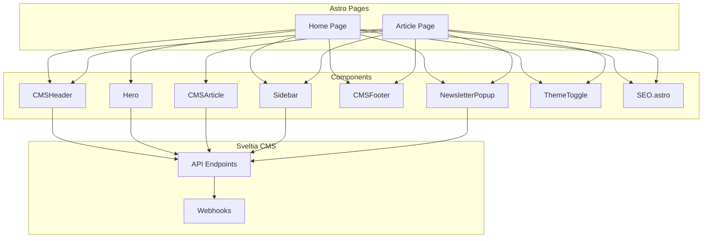

# Astro + Sveltia CMS Integration & Modernization Plan

---

## 1. Component Architecture

- Replace placeholders with Sveltia CMS components:
  - `CMSHeader.svelte`
  - `Hero.svelte`
  - `CMSArticle.svelte`
  - `TrendingWidget.svelte`
  - `SocialWidget.svelte`
  - `CMSFooter.svelte`
  - `NewsletterPopup.svelte`
  - `ThemeToggle.svelte`

- Import in Astro pages:
  ```astro
  ---
  import CMSHeader from '../components/CMSHeader.svelte';
  import Hero from '../components/Hero.svelte';
  import CMSArticle from '../components/CMSArticle.svelte';
  import Sidebar from '../components/Sidebar.svelte';
  import CMSFooter from '../components/CMSFooter.svelte';
  import NewsletterPopup from '../components/NewsletterPopup.svelte';
  import ThemeToggle from '../components/ThemeToggle.svelte';
  ---
  <CMSHeader />
  <Hero />
  <CMSArticle />
  <Sidebar />
  <CMSFooter />
  <NewsletterPopup />
  <ThemeToggle />
  ```

---

## 2. Dynamic Content & API Integration

- Use `.env` variables for API keys and endpoints.
- Fetch content dynamically in Svelte components.
- Use Sveltia CMS webhooks for real-time updates.

---

## 3. SEO & Structured Data

- Use `SEO.astro` with props for dynamic meta tags and JSON-LD.
- Add JSON-LD for Article, BreadcrumbList, VideoObject, Organization.
- Follow `/docs/SEO_POLICY.md`.

---

## 4. Modernization & Performance

- Use Astro.js with Svelte.
- Transition CSS to Tailwind CSS or CSS Modules.
- Use async/await.
- Lazy-load images and iframes.
- Serve images via Imagix CDN.
- Defer non-critical JS.
- Minify assets.
- Ensure accessibility.

---

## 5. File & Folder Structure

```
/src
  /components
    CMSHeader.svelte
    Hero.svelte
    CMSArticle.svelte
    Sidebar.svelte
    CMSFooter.svelte
    NewsletterPopup.svelte
    ThemeToggle.svelte
    SEO.astro
  /pages
    index.astro
    article/[slug].astro
/public
  /styles
  /scripts
/docs
  SEO_POLICY.md
  PRIVACY_POLICY.md
  TERMS_OF_SERVICE.md
  BOT_POLICY.md
.env
astro.config.mjs
package.json
```

---

## 6. Mermaid Diagram: Component & Data Flow



---

_Last updated: 2025-04-05_