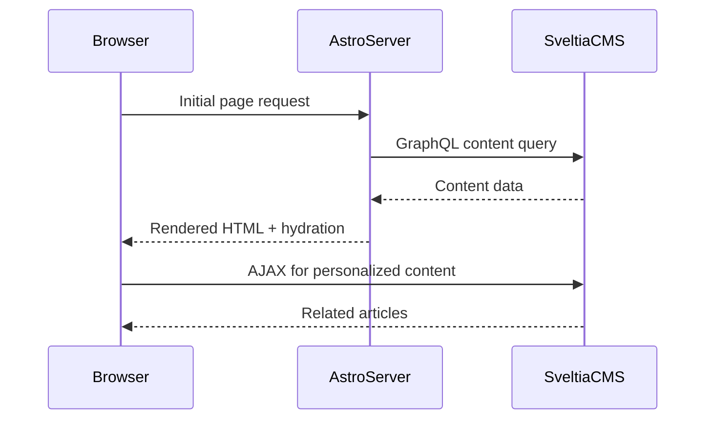

# Astro.js + React + Sveltia-CMS Theme: Detailed Architecture Plan

---

## 1. Project Structure

```
/src
  /components
    /common (buttons, inputs, icons, loaders)
    /layout (Header, Footer, MegaMenu, Sidebar)
    /seo (SEO, JSON-LD, MetaTags)
    /navigation (MegaMenu, PersonalizedRecommendations)
    /images (CDNImage, ImageWithFallback)
    /articles (ArticleCard, ArticlePage, FBIAArticle)
    /pwa (ServiceWorkerRegistration)
    /fbia (FBIAFeedGenerator)
    /redux (slices, store)
    /graphql (queries, mutations, client setup)
    /utils (helpers, fallback logic, scoring)
  /pages
    index.astro
    [slug].astro
    fbia-feed.xml.ts
    sitemap.xml.ts
    robots.txt.ts
/public
  /assets (static assets, icons, manifest)
  /styles (global.css, theme.css, design tokens)
/docs
  setup.md
  deployment.md
  architecture.md
```

---

## 2. Data Flow & GraphQL Integration

- Use Apollo Client or urql with flexible query builder utilities.
- Support SSR and client-side queries.
- GraphQL queries abstracted to allow schema evolution.
- Personalized recommendations fetch related content dynamically.



---

## 3. Redux State Management

- Global store for:
  - User preferences (dark mode, language)
  - Viewed articles history
  - Personalized recommendations
  - Auth/session if needed
- Use Redux Toolkit for slices and async thunks.

---

## 4. Asset Management

- **ImageKit:**
  - URL-based transformations for WebP, responsive sizes
  - Helper `<CDNImage>` component with `srcset`
- **Tebi.io:**
  - S3-compatible fallback
  - Provision bucket, generate signed URLs
- **Fallback Logic:**
  - Try ImageKit URL
  - On error, fallback to Tebi URL
- **Provisioning:**
  - Include steps to create ImageKit account, Tebi bucket, API keys

---

## 5. Navigation

- **Mega Menu:**
  - Multi-level, accessible, keyboard navigable
  - Data-driven from CMS
- **Personalized Recommendations:**
  - Track views in Redux + localStorage
  - Fetch related content via GraphQL
  - Relevancy scoring based on tags/categories
  - SSR fallback with cookie-based personalization

---

## 6. SEO & Structured Data

- React `<SEO>` component generates:
  - Title, meta description, canonical, robots
  - OG + Twitter meta tags
  - hreflang, pagination, viewport
- JSON-LD for:
  - Article, Organization, Breadcrumb, FAQ, WebPage, ImageObject, Person, VideoObject, Product, Review, SiteNavigation, SearchAction
- Auto-generate:
  - `sitemap.xml` with images, videos, news
  - `robots.txt` with crawl rules

---

## 7. Facebook Instant Articles (FBIA)

- Generate FBIA-compliant RSS feed at `/fbia-feed.xml`
- Transform CMS content to FBIA HTML
- Include metadata, styling, ads, analytics
- FBIA-specific layout components
- Error handling for feed generation

---

## 8. PWA & Offline Support

- `manifest.json` with icons, metadata
- Service Worker:
  - Cache-first for static assets
  - Network-first for dynamic content
  - Offline fallback page
- Flash Feed, dark/light mode, reading progress, animations

---

## 9. Security & Cloudflare

- CSP, CORS, HSTS headers via `_headers` file
- Cloudflare WAF rules
- Bad bot blocking
- CSRF protection

---

## 10. Accessibility

- WCAG 2.1 AA compliance
- ARIA roles, keyboard nav, skip links
- Semantic HTML, heading hierarchy

---


## 12. Manual Deployment Workflow

1. Clone repo
2. `npm install`
3. Provision ImageKit & Tebi.io, update `.env`
4. Configure Sveltia-CMS endpoint
5. `npm run build`
6. Upload `dist/` to Cloudflare Pages
7. Configure Cloudflare DNS, SSL, WAF
8. Verify deployment, run tests

---

## 13. Documentation

- **setup.md:** Provisioning, environment variables, local dev
- **deployment.md:** Manual deployment steps
- **architecture.md:** This plan, diagrams, rationale
- Inline comments in codebase