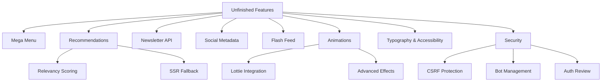

# 🚧 Unfinished & Incomplete Features Report

---

## 1. High-Priority Core Features (from existing `uncompleted.md`)
- **Mega Menu:** Currently uses static data; dynamic fetch from Sveltia-CMS required.
- **Relevancy Scoring:** Algorithm for personalized recommendations **not implemented**.
- **SSR Fallback:** For recommendations on first load is **missing**.
- **Typography:** CSS `clamp()` not fully utilized.
- **Advanced CSS:** Container queries, gestures, foldable support, low-data mode detection **not implemented**.
- **Touch Targets:** Minimum sizing not enforced.
- **CSRF Protection:** Missing for forms.
- **Bot Management:** Allowlist/denylist **not implemented** in code.
- **Auth Flows:** Security of authentication needs review.
- **Flash Feed:** Mobile-only feed with gradient-glow button **not implemented**.
- **Animations:** Lottie integration **incomplete**; glassmorphism, gradient overlays, 3D flip, parallax effects **missing**.

---

## 2. API Integrations
- `smoggy-star/src/pages/api/newsletter.js`
  - `// TODO: Integrate with email marketing service or database`
  - **Status:** Newsletter signup backend integration **not implemented**.

---

## 3. SEO & Social Metadata
- `src/components/SEO.astro`
  - Twitter handle placeholders:
    ```astro
    twitterSite="@yoursite"  {/* TODO: Replace with actual Twitter handle */}
    twitterCreator="@yoursite"  {/* TODO: Replace with author Twitter handle if available */}
    ```
- `src/components/seo/SocialMeta.astro`
  - Facebook OpenGraph:
    ```html
    <meta property="og:site_name" content="Your Site Name" /> <!-- TODO: Replace with actual site name -->
    ```
- **Status:** Social metadata placeholders **need real values**.

---

## 4. UI Components & Features
- **Lottie Animations:** Integration **incomplete**.
- **Flash Feed:** Mobile feed **not yet built**.
- **Advanced Animations:** Glassmorphism, gradient overlays, 3D flip, parallax **missing**.
- **Touch Targets:** Accessibility sizing **not enforced**.
- **Typography:** Responsive scaling with `clamp()` **not fully implemented**.

---

## 5. Security Concerns
- **CSRF Protection:** Not implemented for forms.
- **Bot Management:** Allowlist/denylist logic **missing**.
- **Auth Security:** Needs thorough review.

---

## 6. Server-Side Rendering (SSR)
- **Recommendations SSR fallback:** Not implemented, affecting first load experience.

---

## 7. Third-Party Libraries & Dependencies
- Numerous **TODOs** inside `node_modules/` packages (e.g., Vite, TypeScript, Rollup, Fast-XML-Parser, PrismJS, etc.).  
  **Note:** These are **upstream library TODOs** and **not your responsibility**.

---

## 8. Placeholder or Not Implemented Errors
- `smoggy-star/node_modules/vite/dist/node/chunks/dep-HVlf0cxI.js`
  ```js
  throw Error("readFile not implemented");
  throw Error("writeFile not implemented");
  ```
- `smoggy-star/node_modules/vite/dist/node/module-runner.js`
  ```js
  throw new Error("transport must implement send and connect when invoke is not implemented");
  ```
- `smoggy-star/node_modules/source-map/lib/source-map-consumer.js`
  ```js
  throw new Error("Support for url field in sections not implemented.");
  ```
- **Note:** These are **library internals** and **not your code**.

---

## 9. Documentation & Planning Files
- `uncompleted.md` already contains a **good summary** of missing features.
- `NEED.md`, `RES.md`, and `docs/` may have additional plans (should be reviewed separately).

---

## 10. Summary Table

| Area                     | Status / TODOs                                                                                 |
|--------------------------|------------------------------------------------------------------------------------------------|
| Mega Menu                | Static only, needs dynamic CMS integration                                                    |
| Recommendations          | Relevancy scoring + SSR fallback missing                                                       |
| Newsletter API           | No backend integration                                                                        |
| Social Metadata          | Placeholder values in SEO components                                                          |
| Flash Feed               | Not implemented                                                                               |
| Animations               | Lottie partial, advanced effects missing                                                      |
| Typography               | Clamp() partial, advanced CSS missing                                                         |
| Touch Accessibility      | Not enforced                                                                                  |
| Security                 | CSRF, bot management missing; auth review needed                                              |
| Bot Management           | Allowlist/denylist missing                                                                    |
| Third-party Libraries    | Contain many TODOs, **not your responsibility**                                               |
| Placeholder Errors       | In libraries, **not your responsibility**                                                     |

---

## 11. Next Steps (Recommended)
- **Prioritize** implementing the **Mega Menu dynamic fetch** and **newsletter API integration**.
- **Complete** the **relevancy scoring** and **SSR fallback** for recommendations.
- **Replace** all social metadata placeholders with real values.
- **Implement** Flash Feed and advanced animations.
- **Enforce** accessibility standards (touch targets, typography).
- **Add** CSRF protection and bot management logic.
- **Conduct** a security review of authentication flows.

---

## Mermaid Diagram: High-Level Unfinished Features Map



---

*Generated on 2025-04-08*